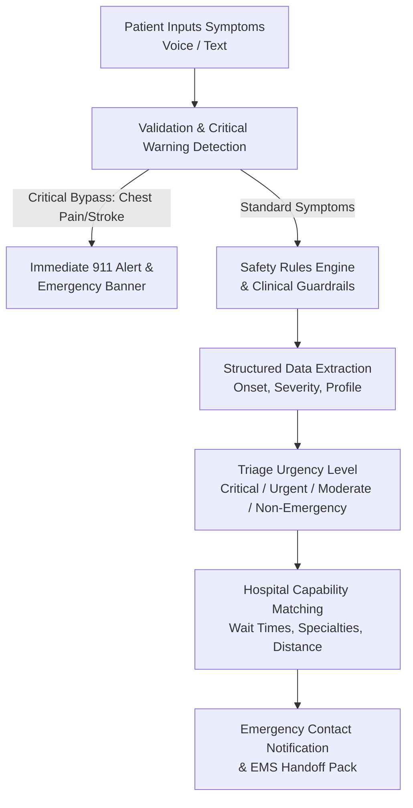

# RescueAI: Safety-First AI Triage & Hospital Routing System

**Executive Summary**  
In medical emergencies, the delay between symptom onset and receiving appropriate care is often the single greatest predictor of patient outcomes. RescueAI is a modern web platform designed to eliminate this delay by providing rapid, AI-driven symptom triage, emergency contact automation, and capability-aware hospital routing. By combining a safety-first multi-stage AI pipeline with real-time facility matching, RescueAI bridges the gap between acute symptom onset and structured medical intervention.

---

## 1. The Problem: The Critical Gap in Emergency Response
When a sudden health crisis occurs, patients and bystanders face two major challenges: **cognitive overload** and **information asymmetry**. 

1. **The Time-to-Care Crisis:** For critical conditions such as stroke, myocardial infarction (heart attack), or severe allergic reactions, the "Golden Hour" determines survival and long-term recovery rates. Every second spent searching for info, waiting on hold, or driving to the wrong facility directly degrades patient outcomes.
2. **Cognitive Overload Under Stress:** During emergencies, individuals experience high stress and panic. This makes it difficult to clearly articulate symptoms, remember critical medical histories (such as allergies or medications), or make rational decisions regarding which medical facility to visit.
3. **The Information Gap for First Responders:** Emergency Medical Services (EMS) and Emergency Department (ED) staff frequently receive patients with little to no pre-arrival structured data. They must spend precious minutes gathering basic medical history, current medications, and onset details, which slows down critical triage.

---

## 2. Who It Affects
The limitations of the current emergency care ecosystem affect several key stakeholders:

* **Patients and Families:** Particularly vulnerable are individuals with chronic illnesses (e.g., diabetes, hypertension), severe allergies, and elderly individuals who need rapid, customized triaging.
* **Emergency Medical Services (EMS) & Paramedics:** Who lack instant, structured access to a patient’s medical profile and precise onset timeline upon arrival.
* **Hospital Emergency Departments (EDs):** Face severe overcrowding and lack early visibility into incoming patients' conditions and medical histories to prepare rooms, specialists, or equipment.
* **Emergency Contacts:** Family members and primary care physicians who are left in the dark during a crisis, delaying proxy consent or coordinated support.

---

## 3. Why Existing Solutions Fail

| Current Approach | Primary Mechanism | Why It Fails in an Emergency |
| :--- | :--- | :--- |
| **Search Engines (Google, WebMD)** | Keyword search on static articles | Generates "cyberchondria" (exaggerating mild symptoms) or dangerous false reassurance. Lacks clinical safety guardrails, is slow, and cannot route patients or share data. |
| **Telehealth Platforms** | Virtual visits with remote doctors | High latency (booking, waiting for a connection), not designed for acute/life-threatening emergencies, and lacks integration with local dispatch or hospital capacity. |
| **Traditional 911 Dispatch** | Voice-only phone communication | Highly effective but subject to dispatcher capacity limits. It lacks a digital interface to automatically transmit the patient's pre-saved medical records, precise location, or real-time triage summaries. |
| **Standard GPS Navigation** | Routes based purely on physical distance | Directs patients to the closest hospital, ignoring whether that facility is overloaded, has an active trauma center, or lacks specialized departments (e.g., pediatric ER). |

---

## 4. The RescueAI Approach: Safety-First Intelligence

RescueAI addresses these failures through a coordinated, multi-stage digital pipeline that integrates conversational AI with clinical guardrails and real-time hospital databases.

### Key Elements of the AI & System Architecture:

1. **Simulated Voice & Natural Language Input:** Patients describe what they are feeling in simple, conversational language. The interface reduces the cognitive burden of navigating complex checkboxes during a panic state.
2. **Dual-Track Safety Validation (Critical Bypass):**
   * **Rule-Based Bypass:** The system runs a hardcoded keyword detection layer for life-threatening indicators (e.g., "chest pain", "slurred speech", "numbness"). If detected, the system bypasses AI processing entirely, triggers an emergency banner, prompts a 911 call, and initiates contact alerts.
   * **AI Guardrails:** For non-bypass cases, a safety rules engine limits the AI's role to *triage support* rather than medical diagnosis, preventing clinical decisions from being made in isolation.
3. **Structured Data Extraction:** The AI translates chaotic natural language inputs into a structured clinical summary, capturing symptom onset, severity (pain level 1-10), and key symptoms. This summary is instantly packaged with the patient's pre-configured medical history (blood type, chronic conditions, medications, allergies).
4. **Intelligent Routing (Capability & Load Matching):** Rather than routing patients to the nearest hospital, RescueAI matches them to the *most appropriate* facility. The system cross-references:
   * **Real-time Wait Times:** Routing patients away from gridlocked ERs.
   * **Specialization Matching:** Identifying if the facility has specialized services (e.g., Pediatrics, Stroke Center, Trauma Center) appropriate for the symptom.
   * **Proximity:** Optimizing travel time without sacrificing care quality.
5. **Closing the Loop (Automated Emergency Broadcasts):** Based on the triage results, RescueAI triggers automated rule-based alerts. For "Critical" or "Urgent" triage levels, the system alerts emergency contacts with the patient's coordinates and medical summary, ensuring loved ones and caregivers are instantly in the loop.

## Conclusion
RescueAI transforms the emergency response experience from a series of disconnected, high-stress decisions into a guided, data-driven journey. By layering safety-first AI over real-time routing and pre-arrival patient profiles, RescueAI ensures patients get to the right care, at the right facility, with the right information—saving valuable minutes when they matter most.
